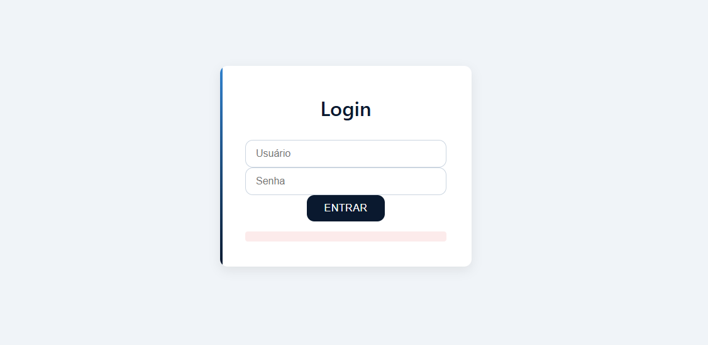
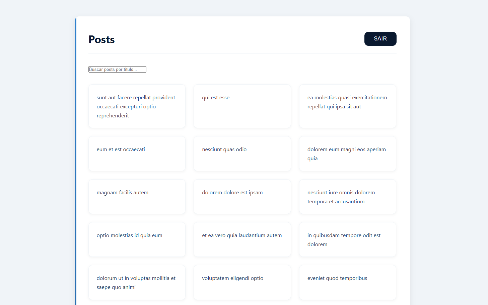
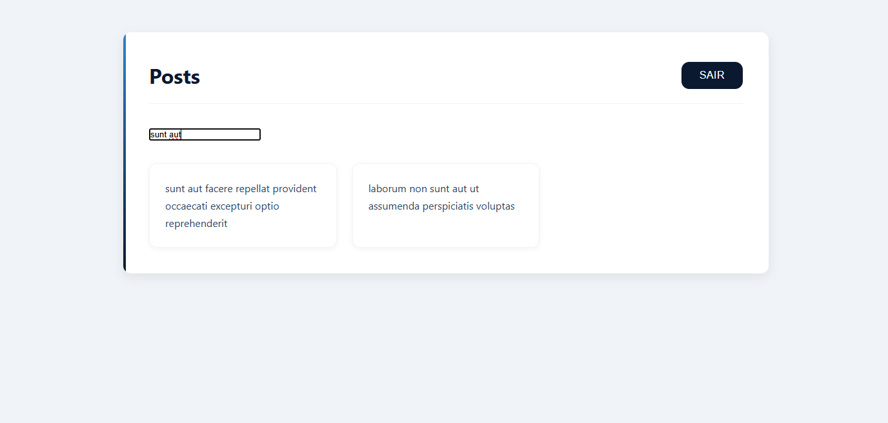
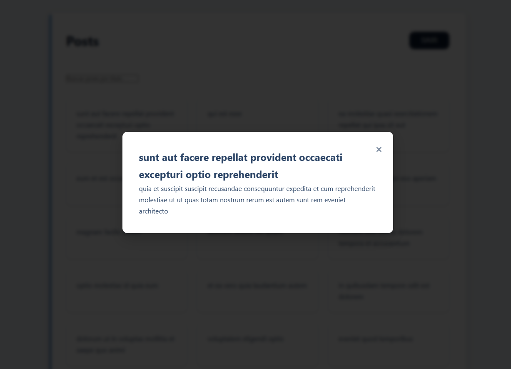

# 📝 Desafio Front-end - Nível Jr

## 🎯 Objetivo
Desenvolver uma aplicação web que consome APIs públicas para autenticação de usuários e exibição de posts, com funcionalidades de busca e visualização detalhada.

## 🖼️ Pré-visualização da Interface

### 🔐 Tela de Login
  
*Interface de login com campos para usuário/senha e botão de acesso*

### 📋 Listagem de Posts
  
*Exibição dos posts em cards com campo de busca integrado*

### 🔍 Detalhes do Post
  
*Modal com conteúdo completo do post selecionado*

### 🚪 Logout
  
*Opção para encerrar a sessão do usuário*

## 🛠️ Requisitos Técnicos

### 📋 Funcionalidades Obrigatórias
1. **Autenticação Segura**
   - Integração com API DummyJSON
   - Armazenamento seguro de tokens (LocalStorage)
   - Mecanismo de refresh token

2. **Gestão de Posts**
   - Listagem em cards
   - Paginação ou scroll infinito
   - Visualização detalhada em modal

3. **Sistema de Busca**
   - Filtro em tempo real
   - Feedback visual durante a pesquisa

4. **Experiência do Usuário**
   - Design responsivo
   - Estados de loading/error
   - Feedback visual para ações

### ⚙️ Stack Tecnológica
| Componente       | Tecnologias Permitidas               |
|------------------|--------------------------------------|
| Frontend         | HTML5, CSS3, JavaScript ES6+         |
| Frameworks       | React/Vue (opcional)                 |
| Estilização      | CSS puro ou pré-processadores        |
| Gerenciamento    | Webpack/Vite (opcional)              |

## 📂 Estrutura do Projeto
```bash
├── public/
│   ├── index.html
├── src/
│   ├── assets/
│   ├── components/
│   │   ├── PostCard.js
│   │   ├── SearchBar.js
│   ├── pages/
│   │   ├── Login/
│   │   │   ├── index.js
│   │   │   ├── style.css
│   │   ├── Posts/
│   │   │   ├── index.js
│   │   │   ├── style.css
│   ├── services/
│   │   ├── api.js
│   │   ├── auth.js
├── README.md
```

## 🔍 Critérios de Avaliação

### 🧠 Lógica e Implementação
- Eficiência no consumo de APIs
- Tratamento adequado de erros
- Gestão de estado da aplicação

### 🎨 Interface e UX
- Consistência visual
- Hierarquia de informação clara
- Acessibilidade básica (ARIA, contrastes)

### ⚡ Performance
- Carregamento otimizado
- Renderização eficiente
- Gerenciamento de memória

## 📤 Processo de Submissão
1. Fork do repositório base
2. Desenvolvimento em branches feature
3. Commits atômicos e descritivos
4. Pull request com:
   - Descrição das alterações
   - Screenshots atualizadas
   - Checklist de requisitos atendidos

## 💡 Dicas Extras
- Implemente skeletons durante loading
- Considere testes unitários básicos
- Documente decisões arquiteturais
- Mantenha consistência nos nomes de variáveis

> **Nota**: A criatividade na solução será valorizada, desde que os requisitos básicos sejam cumpridos. Fique à vontade para adicionar melhorias que julgar relevantes para a experiência do usuário.